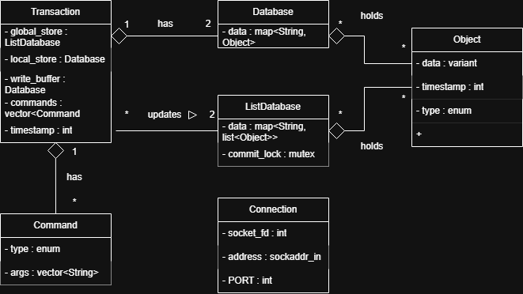

# Yokai

Yokai is an in-memory database inspired by Redis. It supports strings, numbers (as strings), and hash sets. It comes with a server written in C++23 and a REPL built with Python.

To enable persistence, we save the state of the database at regular intervals. When the server starts, we load this data.

Since we spawn a thread for each client, we need to synchronize the global database with the changes made by clients. To achieve this, we use MVCC (Multi-Version Concurrency Control).

A demo of the database can be found [here](https://youtu.be/OwsNCGwe2Ys)

# Contributing

If you want to contribute you should start by forking this repo and creating
a branch for the issue you want to tackle.

You should have installed on you machine the following:
- Zig 0.14.0. Static binary can be downloaded [here](https://github.com/ziglang/zig/releases/tag/0.14.0).
- doxygen. Installation link [here](https://www.doxygen.nl/download.html).
- Git-cliff. Installation link [here](https://git-cliff.org/docs/installation/).
- ClangFormat
- uv. Instalattion link [here](https://github.com/astral-sh/uv)

When you are ready to commit make sure you use [conventional commit](https://www.conventionalcommits.org/en/v1.0.0/)
specification.

## Project structure

### build.zig:

Provides commands to build certain aspects of the project:
```bash
# It will build everything, daemon, repl, tests, docs, etc.
zig build

# Build and run the daemon
zig build run-daemon

# Run the repl
uv run python3 repl/main.py

# Build and run the tests
zig build test

# Format code
zig build format
```

If you add a new `.cpp` file to the project make sure you add it to the
coresponding build step in `build.zig`.

For example, if during the development you added a `daemon/include/math.h` and
`daemon/math.cpp`, you will go to `build.zig > fn build_daemon(...)` and add
`math.cpp` to `daemon_files`.

### common

**common** is a directory which provides `.h` and `.cpp` that implement
shared behaviour for both `REPL` and `DAEMON`.

### daemon
**daemon** is a directory which contains the implementation for the `DAEMON`.

### repl
**repl** is a directory which contains the implementation for the `REPL`.

### tests
**tests** is a directory which contains all the project's tests.

### lib
**lib** is a directory which includes all library dependencies we need.

# Diagrams
### Class Diagram


### Workflow diagram


## References
- https://www.postgresql.org/docs/7.1/mvcc.html
- [AI use](https://github.com/R3ZV/Yokai/wiki/AI-prompt-engineering)
